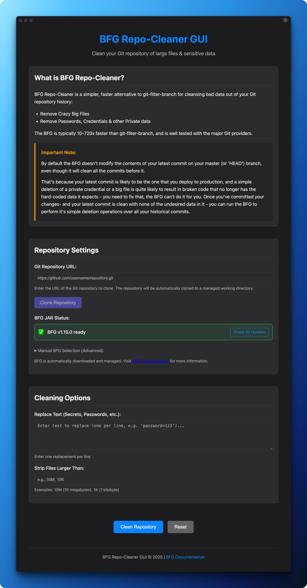

<div align="Center">
  
</div>

# BFG Repo-Cleaner GUI

A cross-platform GUI application for [BFG Repo-Cleaner](https://rtyley.github.io/bfg-repo-cleaner/), a simpler and faster alternative to git-filter-branch for cleaning Git repositories of sensitive data and large files.

## Screenshot

<div align="Center">
  
</div>

## Features

- **Secret Detection in HEAD Branch**: Automatically checks for secrets/sensitive data in your HEAD branch before running BFG
- **HEAD Branch Cleaning**: Optional automatic removal of secrets from HEAD branch with commit and push
- **Repository History Cleaning**: Clean Git repositories of sensitive data such as passwords, API keys, etc.
- **Large File Removal**: Remove large files from Git history
- **Modern, User-friendly Interface**: Clean and intuitive GUI
- **Cross-platform**: Works on Windows, macOS, and Linux
- **Workflow Integration**: Seamless workflow from cloning to cleaning to pushing

### Secret Detection Workflow

The application now includes a new safety feature that checks for secrets in your HEAD branch before running BFG Repo-Cleaner:

1. **Automatic Detection**: When you click "Clean Repository", the app first searches for any of your specified secrets in the HEAD branch
2. **Warning Display**: If secrets are found, a warning dialog shows exactly which secrets were found and in which files
3. **Safe Options**: You can choose to:
   - **Clean Secrets from HEAD**: Automatically replace secrets with "REMOVED" in HEAD, commit, and push the changes
   - **Abort Operation**: Cancel the operation and manually clean your HEAD branch first

> **⚠️ Important**: BFG Repo-Cleaner doesn't modify your HEAD branch by default. This new feature ensures your HEAD branch is clean before running the history cleaning process.

## Installation

### Download Pre-built Binary

You can download the latest pre-built application binary for your platform from the [GitHub Releases page](https://github.com/go2engle/bfg-repo-cleaner-gui/releases/latest).

Available platforms:
- Windows (.exe installer, .zip)
- macOS (.dmg, .zip)
- Linux (.deb, .rpm, .AppImage)

### Prerequisites for Running the Application

- Java Runtime Environment (JRE) - required to run BFG Repo-Cleaner
- [BFG Repo-Cleaner JAR file](https://rtyley.github.io/bfg-repo-cleaner/) - download this separately

### macOS Security Notice

If you're using macOS and encounter security restrictions when launching the application, you may need to remove the quarantine attribute with the following command:

```bash
sudo xattr -rd com.apple.quarantine "/Applications/bfg-repo-cleaner-gui.app"
```

## Development

### Prerequisites for Development

- Node.js and npm
- Java Runtime Environment (JRE)

### Install Dependencies

```bash
npm install
```

### Run in Development Mode

```bash
npm run dev
```

### Build for Production

```bash
npm run build
```

### Package the Application

```bash
npm run package
```

### Create Installers

```bash
npm run make
```

## License

MIT
